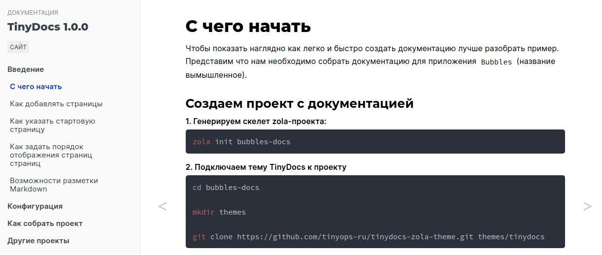

# Тема TinyDocs для Zola

Тема для создания HTML-документации для генератора статических сайтов [Zola](https://www.getzola.org/).



## Как начать разработку

```shell
zola serve
```

## Как собрать

```shell
zola build --output-dir docs --base-url https://your-site.com
```

Результат будет в каталоге `docs`.
